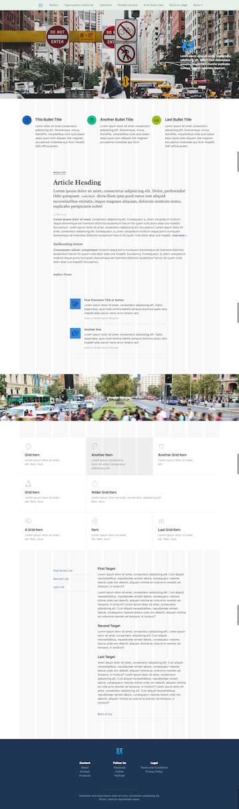

# Practice of using Gulp for Refills (Bourbon, Neat, Bitters)


## About

This is my __practice__ for which I use [Refills](http://refills.bourbon.io/) ([Bourbon](http://bourbon.io/), [Neat](http://neat.bourbon.io/), [Bitters](http://bitters.bourbon.io/)) with Gulp, Browsersync, Sass.  

I made this for the following purposes  

* I want to use Refills, but do not want to use too much Bourbon, Neat, Bitters.
* I want the environment which is automatically compiled Sass, concated Refills's javascript and reloaded web browser.
* __Now__, I don't need CoffeeScript, HTML template, image optimization, switching of  development and production, deploying to server.
* But my Gulp's skill is poor...

So, I have made very very simple.  
And I don't edit scss and javascript files of Refills, Bourbon, Neat, Bitters, I think that it is contrary to [thoughtbot](https://thoughtbot.com/)'s philosophy...  


## Preview



Demo icons: [Icons8](https://icons8.com/), demo images: [Unsplash](https://unsplash.com/)  


## Included

* [Gulp](http://gulpjs.com/)
* [Browsersync](https://www.browsersync.io/docs/gulp/)
* [gulp-ruby-sass](https://www.npmjs.com/package/gulp-ruby-sass/), with [node-normalize-scss](https://www.npmjs.com/package/node-normalize-scss), [gulp-sourcemaps](https://www.npmjs.com/package/gulp-sourcemaps), [gulp-pleeease](https://www.npmjs.com/package/gulp-pleeease)
* [gulp-concat](https://www.npmjs.com/package/gulp-concat), [gulp-uglify](https://www.npmjs.com/package/gulp-uglify)

If using [node-bourbon](https://www.npmjs.com/package/node-bourbon), [node-neat](https://www.npmjs.com/package/node-neat) and Gem's Bitters, an error happened, [Undefined variable: "$font-stack-system" (not using rails) · Issue #240 · thoughtbot/bitters](https://github.com/thoughtbot/bitters/issues/240) at October, 2016.  
So I can't use node-bourbon, node-neat.  


## Getting Started

### 1. Install gems, if you does not install.

```
$ gem install sass
$ gem install bourbon
$ gem install neat
$ gem install bitters
```

### 2. Clone the project from GitHub

```
$ git clone https://github.com/dollplayer2501/practice_gulp_refills.git
```

### 3. Install project dependencies and Bourbon, Neat, Bitters

```
$ cd practice_gulp_refills/
$ npm install
$ cd _source/assets/stylesheets/base/
$ bourbon install
$ neat install
$ bitters install
```

`bourbon install`, `neat install`, `bitters install` should be performed `practice_gulp_refills/_source/assets/stylesheets/base/`.  


### 4. Compile and run

```
$ cd ../../../..
$ pwd
/file/to/path/practice_gulp_refills
$ gulp
```
